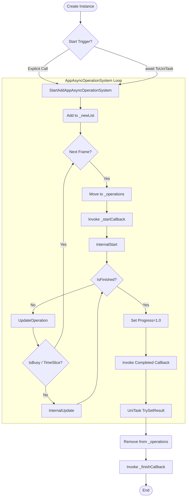

# 异步操作系统 (AppAsyncOperationSystem) 技术文档

## 1. 概述 (Overview)

`AppAsyncOperationSystem` 是一个专为 Unity 开发的高性能、基于 UniTask 的异步操作管理系统。它参考了 YooAsset 的 `OperationSystem` 设计理念，旨在提供统一的生命周期管理、时间片调度、优先级排序以及零分配（Zero-Allocation）的异步等待体验。

本系统完全剥离了 Unity 原生协程（Coroutine）依赖，全面拥抱 `UniTask`，适用于高并发、高性能敏感的游戏逻辑场景（如资源加载、状态机流转、网络请求队列等）。

## 2. 核心特性 (Key Features)

*   **UniTask 原生支持**：基于 `UniTaskCompletionSource` 实现，支持 `await` 等待，无缝集成 C# 异步生态。
*   **统一生命周期**：提供 `Start` -> `Update` -> `Finish` 的标准化流程，系统统一驱动，杜绝野任务。
*   **时间片调度 (Time Slicing)**：支持单帧最大执行时间限制 (`MaxTimeSlice`)，防止主线程卡死（Hiccup）。
*   **优先级管理**：支持任务优先级排序，高优先级任务优先执行。
*   **扁平化调度**：子任务与父任务扁平化管理，避免递归更新带来的栈开销与 Cache Miss。
*   **扩展更新模式**：除标准 Update 外，额外支持 `SecondUpdate` (秒级更新) 和 `UnScaleTimeUpdate` (不受时间缩放更新)。
*   **零分配优化**：任务完成源按需创建，取消注册及时释放，减少 GC Pressure。

---

## 3. 架构设计 (Architecture)

### 3.1 类图概览

*   **`AppAsyncOperationBase`** (抽象基类)
    *   定义异步操作的基本状态 (`Status`, `Progress`, `Error`)。
    *   实现 `ToUniTask()` 供外部等待。
    *   定义生命周期虚方法 (`InternalStart`, `InternalUpdate` 等)。
*   **`AppAsyncOperationSystem`** (静态管理类)
    *   维护所有活动的异步操作列表。
    *   负责每帧轮询 (`LifeUpdate`)，处理新增、移除、更新逻辑。
    *   提供全局事件钩子 (`RegisterStartCallback`, `RegisterFinishCallback`)。
*   **`AppGameAsyncOperation`** (业务中间层)
    *   继承自基类，屏蔽 `Internal` 前缀方法，暴露 `OnStart`, `OnUpdate` 等业务友好接口。
    *   作为业务逻辑继承的推荐基类。
*   **`AppStateMachineAsyncOperation`** (状态机适配)
    *   专用于状态机的异步化封装，将状态机生命周期托管给系统。

### 3.2 生命周期流转



1.  **创建 (Creation)**: 用户 `new` 一个操作实例。
2.  **启动 (Start)**: 调用 `StartOperation()` 或被 `ToUniTask()` 隐式触发。任务加入 `_newList` 队列。
3.  **调度 (Scheduling)**:
    *   下一帧系统将 `_newList` 合并入 `_operations`。
    *   触发 `_startCallback`。
    *   调用 `InternalStart()`。
4.  **执行 (Execution)**:
    *   每帧系统遍历 `_operations` 调用 `UpdateOperation()`。
    *   若启用时间片且超时 (`IsBusy`)，后续任务推迟到下一帧。
5.  **完成 (Completion)**:
    *   业务逻辑设置 `IsFinish = true` 或调用 `Complete`。
    *   触发 `ToUniTask` 的 awaiter 继续执行。
    *   触发 `Completed` 回调。
6.  **销毁 (Cleanup)**:
    *   系统从列表移除该任务。
    *   触发 `_finishCallback`。

---

## 4. 使用指南 (Usage Guide)

### 4.1 定义一个异步操作

推荐继承 `AppGameAsyncOperation`，它提供了清晰的重写入口。

```csharp
using RSJWYFamework.Runtime;
using Cysharp.Threading.Tasks;

public class MyDownloadOperation : AppGameAsyncOperation
{
    private float _timer;
    
    // 1. 初始化逻辑
    protected override void OnStart()
    {
        _timer = 0;
        Status = AppAsyncOperationStatus.Processing;
    }

    // 2. 轮询逻辑 (每帧调用)
    protected override void OnUpdate()
    {
        if (Status != AppAsyncOperationStatus.Processing) return;

        _timer += UnityEngine.Time.deltaTime;
        Progress = _timer / 5.0f; // 模拟进度

        // 模拟5秒后完成
        if (_timer >= 5.0f)
        {
            Status = AppAsyncOperationStatus.Succeed;
        }
    }

    // 3. (可选) 处理取消逻辑
    protected override void OnAbort()
    {
        // 清理资源，如关闭 Socket
    }
    
    // ... 其他接口按需实现
}
```

### 4.2 调用与等待

支持同步风格的“发后不理”和异步风格的“等待结果”。

```csharp
// 方式 A: 纯异步等待 (推荐)
public async UniTask Void RunTask()
{
    var op = new MyDownloadOperation();
    // StartAsync 会自动将任务注册到系统并启动
    // op.StartAddAppAsyncOperationSystem("Download_01");
    
    try 
    {
        await op.ToUniTask(this.GetCancellationTokenOnDestroy());
        Debug.Log("任务成功！");
    }
    catch (OperationCanceledException)
    {
        Debug.Log("任务被取消");
    }
    catch (Exception ex)
    {
        Debug.LogError($"任务失败: {ex}");
    }
}

// 方式 B: 仅注册，不等待
var op2 = new MyDownloadOperation();
AppAsyncOperationSystem.StartOperation("FireAndForget", op2);
```

### 4.3 状态机异步化

通过继承 `AppStateMachineAsyncOperation`，可以将状态机的生命周期映射到异步操作中。

```csharp
public class MyFsmOperation : AppStateMachineAsyncOperation
{
    public MyFsmOperation()
    {
        // 1. 创建状态机
        var sm = new StateMachine<MyFsmOperation>(this, "MyFSM");
        sm.AddNode(new InitNode());
        
        // 2. 初始化基类（绑定状态机）
        InitStateMachine(sm, typeof(InitNode));
        
        // 3. 注册到系统
        AppAsyncOperationSystem.StartOperation("MyFSM_Op", this);
    }
}

// 使用
var op = new MyFsmOperation();
await op.ToUniTask();
```

---

## 5. 关键机制详解

### 5.1 扁平化调度 (Flattening)

旧版实现中，父任务负责递归调用子任务的 Update。
**现在**：推荐所有子任务都通过 `AppAsyncOperationSystem.StartOperation` 注册为独立的一级任务。
*   **优势**：避免深层递归，提高 CPU Cache 命中率；时间片检查对所有任务生效，避免子任务“偷跑”导致掉帧。

### 5.2 时间片 (Time Slicing)

通过设置 `AppAsyncOperationSystem.MaxTimeSlice` (毫秒)，可以限制每帧处理异步任务的总耗时。
*   默认值：`long.MaxValue` (不限制)。
*   建议值：在低端机或重负载场景设为 `5-10ms`。

### 5.3 扩展更新频率

除了标准的 `OnUpdate`，还提供：
*   **`OnSecondUpdate`**: 每秒调用一次。适合低频逻辑（如网络心跳、自动保存检查）。
*   **`OnSecondUpdateUnScaleTime`**: 每秒调用一次，忽略 `Time.timeScale`。适合 UI 动画相关的后台逻辑。

---

## 6. 注意事项 (Best Practices)

1.  **禁止同步等待**：`WaitForAsyncComplete` 等同步等待接口已被**彻底移除**，以防止主线程死锁。请务必使用 `await op.ToUniTask()`。
2.  **资源释放**：在 `OnAbort` 中务必清理非托管资源（文件句柄、Socket）。系统会在任务被取消或销毁时调用此方法。
3.  **ToUniTask 重入**：`ToUniTask` 支持多次调用，但会返回同一个 `Task`。注意：**后续调用传入的新 `CancellationToken` 将被忽略**，系统会打印警告。
4.  **异常隔离**：任务 `OnStart`/`OnUpdate` 中的未捕获异常会被系统捕获，将任务状态标记为 `Failed`，并打印 `LogException`。这确保了单个任务崩溃不会拖累整个系统。
5.  **全局销毁行为**：调用 `AppAsyncOperationSystem.DestroyAll()` 时，所有进行中的任务都会收到 `AbortOperation()` 调用，导致等待处抛出 `OperationCanceledException`。这是为了防止 await 逻辑永久挂起。

## 7. 版本记录

*   **v2.1 (最新)**: 健壮性增强。
    *   彻底移除同步等待接口。
    *   修复 `DestroyAll` 导致的永久挂起风险。
    *   增加 `ToUniTask` 重入保护。
    *   增强系统异常隔离与回调保护。
*   **v2.0**: 重构为 UniTask 版本。
    *   移除 `IEnumerator` 依赖。
    *   对齐 YooAsset 生命周期。
    *   引入扁平化调度。
    *   优化 `CancellationToken` 资源泄漏问题。
*   **v1.0**: 初始版本，基于 Unity 协程。
